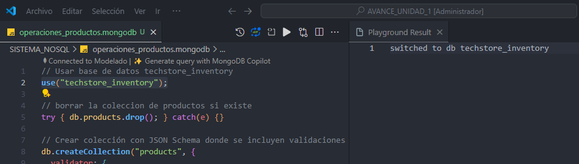
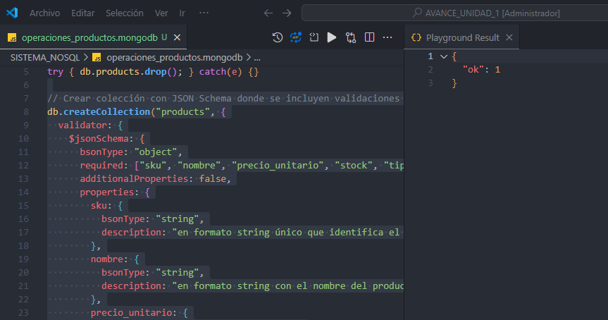
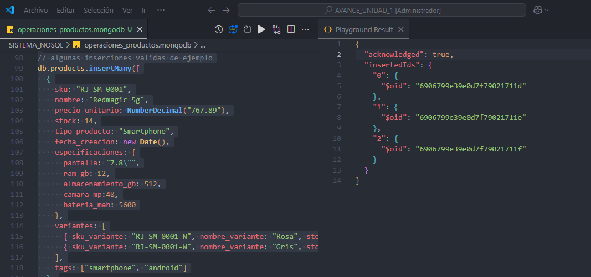
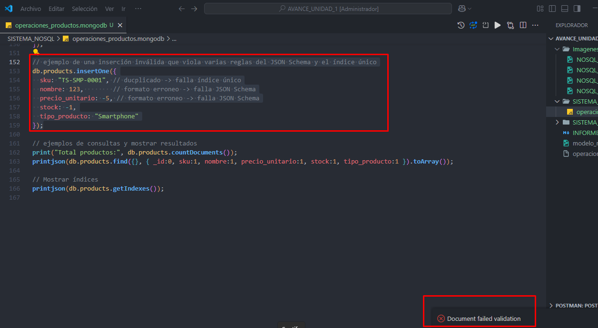
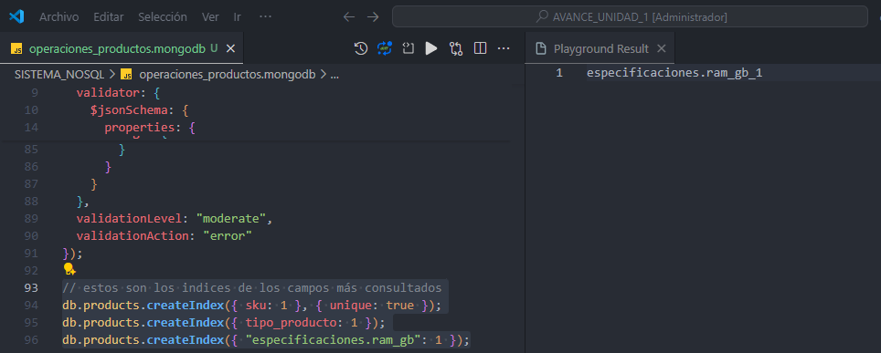
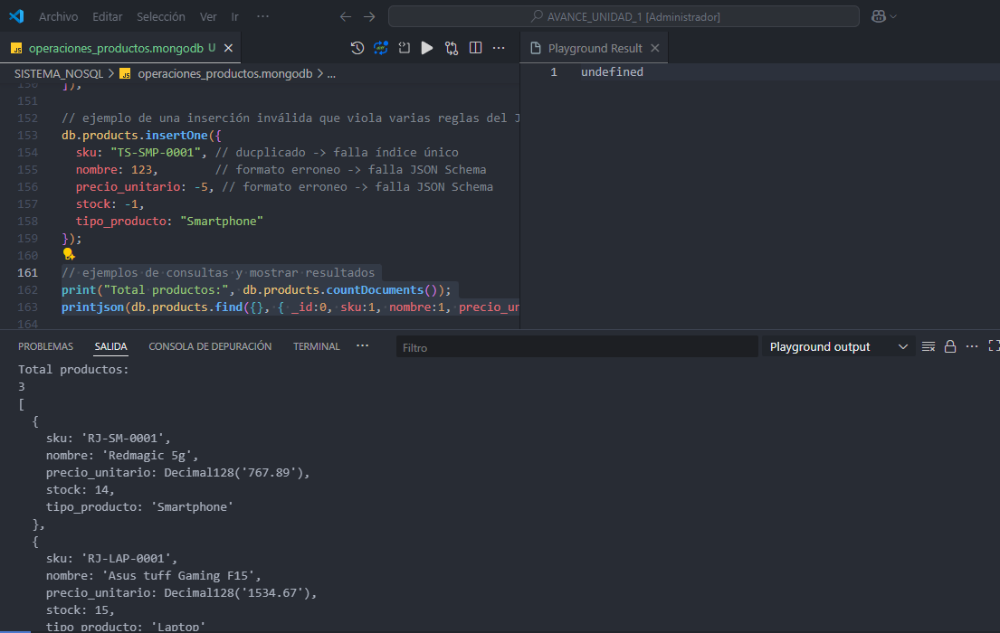
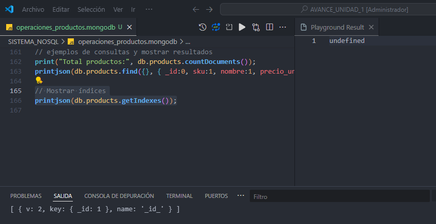
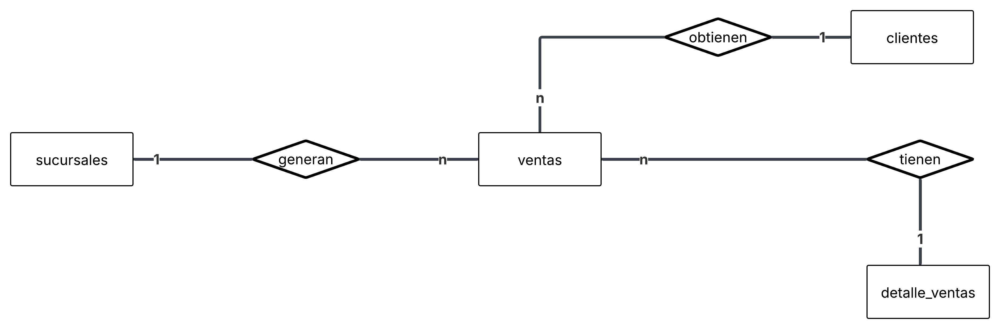

# INFORME_U1.md

- Autor: Ronald Puruncajas
- Carrera: Ingeniería en Tecnologías de la Información  
- Unidad: 1
- Fecha: 1/11/25

## 1. Introducción

El presente informe corresponde al Avance 1 del Proyecto Macro de Business Intelligence para la cadena minorista TechStore.  
En esta primera fase se modelan los sistemas operacionales que sirven como fuente de datos para el futuro Data Mart de Ventas.

TechStore enfrenta el desafío de tener sus datos distribuidos en distintos sistemas:
- Inventario y catálogo de productos en una base NoSQL, debido a la naturaleza flexible y variable de los atributos de cada producto.
- Transacciones, clientes y sucursales en una base relacional, donde se requiere consistencia y control transaccional.

El objetivo de este avance es comprender, justificar y documentar la arquitectura dual SQL/NoSQL y evaluar la calidad de los datos en los sistemas de origen.

---

## 2. Justificación del Modelo Dual

En los entornos empresariales modernos, la coexistencia de bases de datos relacionales y bases NoSQL es una práctica común, especialmente cuando se manejan distintos tipos de información con requerimientos heterogéneos.

En el caso de TechStore:

| Criterio | Sistema Relacional | Sistema NoSQL | Justificación |
|-----------|-----------------------------------|--------------------------------------|----------------|
| Tipo de datos | Altamente estructurados | Semi-estructurados | Los productos pueden tener distintos atributos, lo cual no encaja bien en tablas fijas. |
| Modelo de consistencia | ACID: garantiza integridad transaccional entre ventas, clientes y sucursales. | BASE: mayor flexibilidad y disponibilidad, sacrifica consistencia estricta. | Las ventas requieren coherencia absoluta; el inventario no. |
| Estructura del esquema | Estático y normalizado. | Dinámico y adaptable. | Ideal cuando las estructuras cambian constantemente, como especificaciones técnicas. |
| Escalabilidad | Vertical. | Horizontal | MongoDB permite escalar fácilmente el catálogo conforme aumenta la cantidad de productos. |
| Velocidad de lectura y escritura | Escrituras transaccionales seguras pero más costosas. | Lecturas rápidas y eficientes para catálogos y búsquedas por campo. | Permite responder con rapidez en catálogos grandes con consultas no estructuradas. |
| Casos de uso ideales | Transacciones de ventas, control de clientes y sucursales. | Inventario, catálogos, especificaciones y metadatos de productos. | Dualidad funcional: SQL para operaciones críticas y NoSQL para flexibilidad. |

Conclusión:  
El modelo dual garantiza que TechStore aproveche la fortaleza de ambos paradigmas:
- SQL para asegurar integridad y consistencia en las operaciones de venta.  
- NoSQL para gestionar catálogos dinámicos con múltiples atributos, sin depender de una estructura rígida.

---

## 3. Informe de Calidad de Datos

La calidad de los datos en los sistemas OLTP es fundamental para asegurar la confiabilidad del análisis de inteligencia de negocios.  
Durante la revisión de los modelos de TechStore, se identificaron tres posibles problemas de calidad de datos, junto con sus causas y medidas correctivas.

| Nº | Problema potencial | Sistema afectado | Descripción y ejemplo | Acción correctiva propuesta |
|----|--------------------|------------------|-----------------------|-----------------------------|
| 1 | SKU no coincidente entre sistemas | SQL ↔ NoSQL | En la tabla `detalle_ventas`, puede registrarse un `sku_producto` que no exista en la colección `productos` de MongoDB.  Ejemplo: venta con SKU “RJ-SMP-9999” inexistente en catálogo. | Implementar validación en procesos ETL: verificar existencia del SKU en MongoDB antes de insertar en SQL. Registrar casos faltantes en tabla de auditoría `auditoria_skus_faltantes`. |
| 2 | Duplicados en el catálogo de productos | NoSQL | Sin un índice único, podrían crearse dos documentos con el mismo campo `sku`.  Ejemplo: dos registros diferentes con `sku: "RJ-SMP-0001"`. | Aplicar índice único `{ sku: 1, unique: true }` en la colección `productos` y establecer validación `validationAction: "error"`. |
| 3 | Datos incompletos o mal formateados en clientes | SQL | Campos `email` en la tabla `clientes` pueden estar nulos o con formato incorrecto (`juan@`, `NULL`). | Definir restricciones y validaciones:   - `CHECK (email LIKE '%@%.%')` o validación por aplicación.   - Políticas de limpieza y verificación de datos antes de carga. |

Resumen general de calidad de datos:
- Integridad referencial: debe garantizarse mediante relaciones entre `ventas`, `detalle_ventas` y `clientes`.
- Unicidad de claves: uso de índices únicos en campos clave (`sku`, `email`, `id_cliente`).
- Consistencia semántica: estandarizar nombres de campos, tipos de datos y formatos (por ejemplo, fechas y decimales).

---

# 4. imagenes

# 4.1 Creacion database nosql

# 4.2 Creacion de la coleccion

# 4.3 Insercion de datos validos

# 4.4 Insercion de datos invalidos

# 4.5 Creacion de los index

# 4.6 Consulta de los productos

# 4.7 Consulta de los indices

# 4.8 Diagrama de entidad relacion

## 5. Conclusiones

El análisis del modelo dual y de la calidad de los datos evidencia que:

1. La integración de SQL y NoSQL demuestra que ambos modelos se complementan, combinando la estructura y consistencia de los datos transaccionales con la flexibilidad necesaria para procesar información dinámica, como catálogos de productos.

2. La calidad de la inteligencia empresarial depende directamente de la integridad y precisión de los datos fuente; los errores o inconsistencias en los sistemas operativos comprometen la fiabilidad del análisis final.

3. Las validaciones implementadas en MongoDB mediante JSON Schema y en SQL mediante restricciones garantizan una base de datos robusta, preparada para futuros procesos de análisis y visualización.

---
